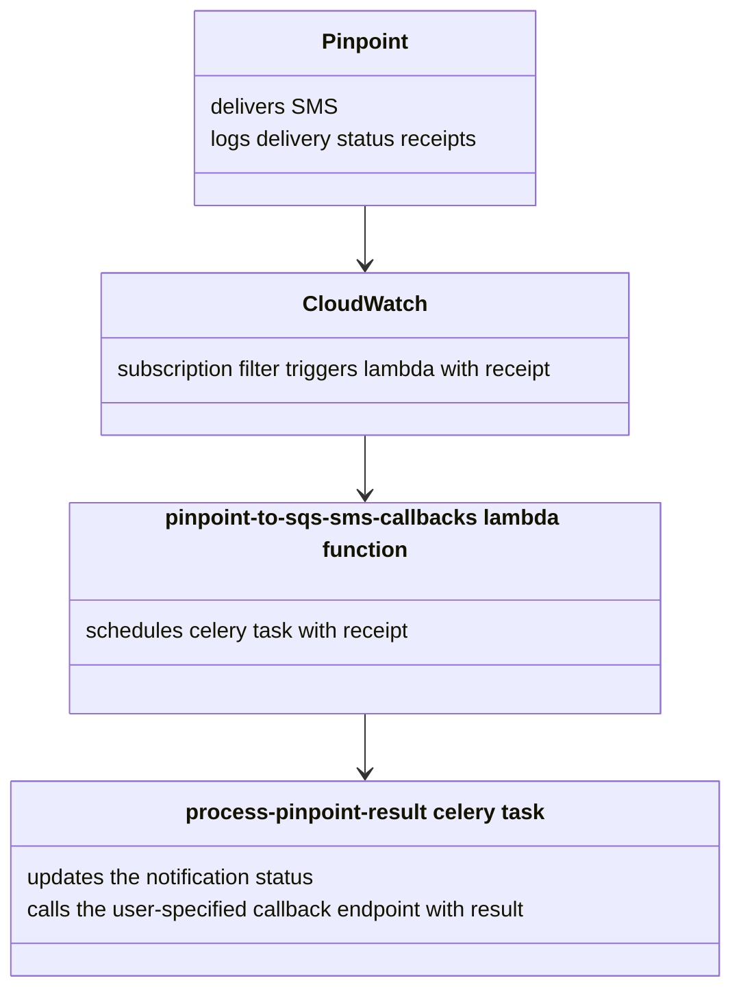

# Purpose

This lambda gets the Pinpoint receipt from AWS and then calls a task to update the notification in Notify's DB.

## Lambda Invocation

1. SMS gets sent through Notify
1. The SMS receipt is written to 2 different cloudwatch log-groups: PinpointDirectPublishToPhoneNumber and PinpointDirectPublishToPhoneNumber/Failure
1. The pinpoint_to_sqs_sms_callbacks lambda is a subscription-filter on the above two log-groups.
1. The lambda takes the sms receipt and sends it to a celery queue `eks-notification-canada-cadelivery-receipts` with a task `process-pinpoint-result`

## How it works

