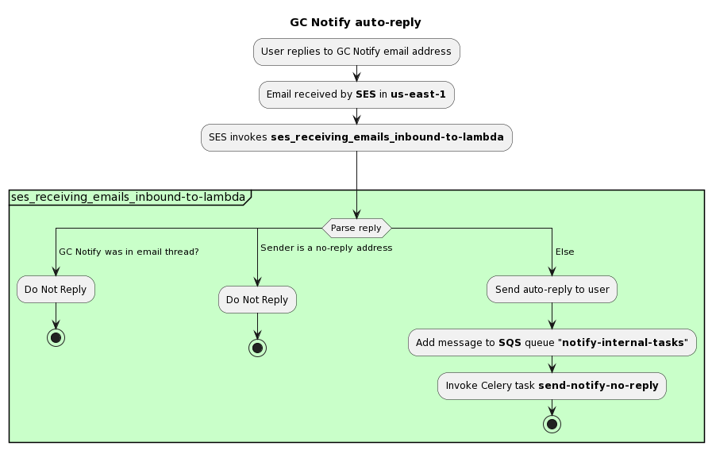

# ses_receiving_emails

The `ses_receiving_emails` lambda function handles incoming emails from SES and returns a message to users to let them know that the inbox they are trying to send to is not monitored. The function is hosted on AWS lambda and is triggered by SES.

## How it works

<!--
@startuml
title GC Notify auto-reply
:User replies to GC Notify email address;
:Email received by **SES** in **us-east-1**;
:SES invokes **ses_receiving_emails_inbound-to-lambda**;
-> \n\n;
partition #Technology "ses_receiving_emails_inbound-to-lambda" {
   switch (Parse reply)
      case ( GC Notify was in email thread? )
         :Do Not Reply;
         stop
      case ( Sender is a no-reply address\n ) 
        :Do Not Reply;
        stop
      case ( Else )
        :Send auto-reply to user;
        :Add message to **SQS** queue "**notify-internal-tasks**";
        :Invoke Celery task **send-notify-no-reply**;
        stop
   endswitch
}
@enduml
-->