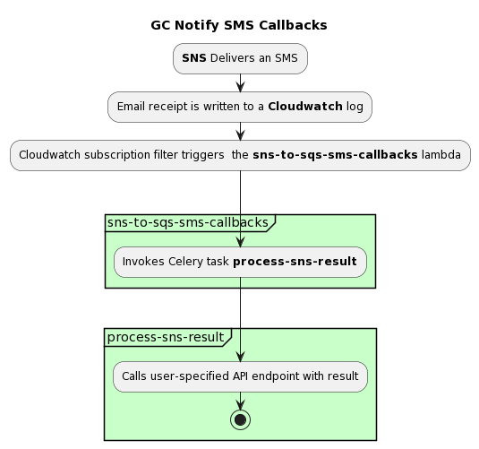

# Purpose

This lambda gets the sns receipt from AWS and then calls a task to update the notification in Notify's DB.

## Lambda Invocation

1. SMS gets sent through Notify
1. The email receipt written to 2 different cloudwatch log-groups: DirectPublishToPhoneNumber and DirectPublishToPhoneNumber/Failure
1. The sns_to_sqs_sms_callbacks lambda is a susbription-filter on the above two log-groups.
1. The lambda takes the sms receipt and sends it to a celery queue `eks-notification-canada-cadelivery-receipts` with a task `process-sns-result`

## How it works

<!--
@startuml

title GC Notify SMS Callbacks
:**SNS** Delivers an SMS;
:Email receipt is written to a **Cloudwatch** log;
:Cloudwatch subscription filter triggers  the **sns-to-sqs-sms-callbacks** lambda;
-> \n\n;
partition #Technology "sns-to-sqs-sms-callbacks" {
  :Invokes Celery task **process-sns-result**;
}
-> \n;
partition #Technology "process-sns-result" {
  :Calls user-specified API endpoint with result;
  stop
}
@enduml
-->